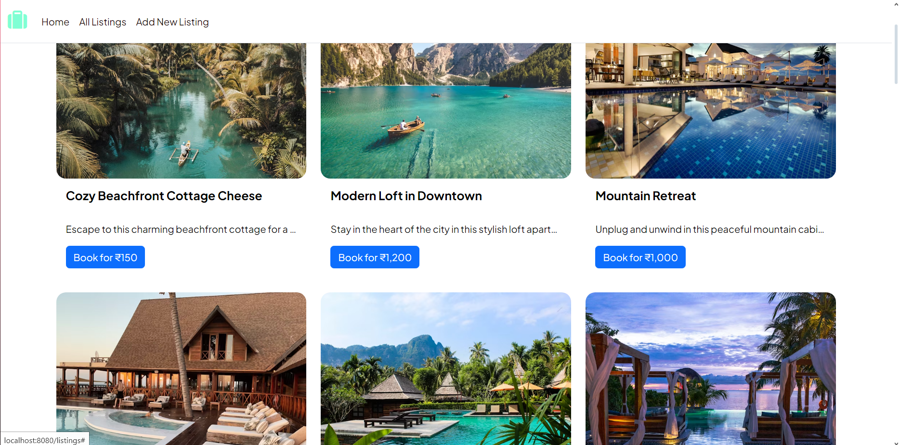

# Aashiyana - An AirBnb Replica

This is an attempt to make a website that works like the famous house rental website AirBnb, where people can rent houses or rooms for some days when travelling.

## Table of contents

- [Overview](#overview)
  - [Screenshot](#screenshot)
  - [Links](#links)
- [My process](#my-process)
  - [Built with](#built-with)
  <!-- - [What I learned](#what-i-learned) -->
  - [Continued development](#continued-development)
- [Author](#author)

## Overview

### Screenshot

### Links

- Live Site URL: [Add live site URL here](https://your-live-site-url.com)

## My process

### Built with

- Semantic HTML5 markup
- CSS custom properties
- Flexbox
- CSS Grid
- Mobile-first workflow
- [Bootstrap](www.getbootstrap.com) - Framework
- [Express](https://expressjs.com/) - JS library
- [EJS](https://ejs.co/) - JS Library

<!-- ### What I learned

Use this section to recap over some of your major learnings while working through this project. Writing these out and providing code samples of areas you want to highlight is a great way to reinforce your own knowledge.

To see how you can add code snippets, see below: -->

### Continued development

I want to keep adding new functionalities and improve the design as I keep enchancing my skills.

## Author

- LinkedIn - [Priyanshu Makwana](https://www.linkedin.com/in/priyanshu-makwana-277b93261/)
- Instagram - [@priyanshu_prime](https://www.instagram.com/priyanshu_prime/)

